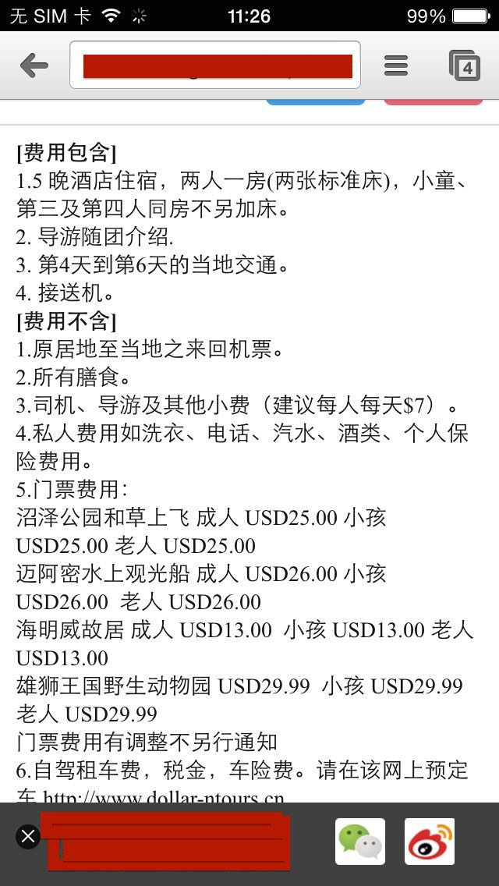

## 问题列表

### 伪类 :active 生效

要CSS伪类 `:active` 生效，只需要给 document 绑定 `touchstart` 或 `touchend` 事件

    <style>
    a {
      color: #000;
    }
    a:active {
      color: #fff;
    }
    </style>
    <a herf=foo >bar</a>
    <script>
      document.addEventListener('touchstart',function(){},false);
    </script>

### 消除 transition 闪屏

两个方法

    -webkit-transform-style: preserve-3d;
    /*设置内嵌的元素在 3D 空间如何呈现：保留 3D*/
    -webkit-backface-visibility: hidden;
    /*（设置进行转换的元素的背面在面对用户时是否可见：隐藏）*/
    
### 消除 IE10 里面的那个叉号

    input:-ms-clear{display:none;}
    
来源出处：[http://msdn.microsoft.com/en-us/library/windows/apps/hh767361.aspx](http://msdn.microsoft.com/en-us/library/windows/apps/hh767361.aspx "article4")
    
###关于 iOS 与 OS X 端字体的优化(横竖屏会出现字体加粗不一致等)
iOS 浏览器横屏时会重置字体大小，设置 `text-size-adjust` 为 `none` 可以解决 iOS 上的问题，但桌面版 Safari 的字体缩放功能会失效，因此最佳方案是将 `text-size-adjust` 为 `100%` 。

    -webkit-text-size-adjust: 100%;
    -ms-text-size-adjust: 100%;
	text-size-adjust: 100%;
    
### JS 事件相关
click 事件普遍 300ms 的延迟
在手机上绑定 click 事件，会使得操作有 300ms 的延迟，体验并不是很好。
开发者大多数会使用封装的 tap 事件来代替 click 事件，所谓的 tap 事件由 touchstart 事件 + touchmove 判断 + touchend 事件封装组成

### iOS 点击会慢 300ms 问题

 [https://developers.google.com/mobile/articles/fast_buttons?hl=de-DE](https://developers.google.com/mobile/articles/fast_buttons?hl=de-DE "article5")
 [http://stackoverflow.com/questions/12238587/eliminate-300ms-delay-on-click-events-in-mobile-safari](http://stackoverflow.com/questions/12238587/eliminate-300ms-delay-on-click-events-in-mobile-safari "article5")

使用 CSS3 动画的时尽量利用3D加速，从而使得动画变得流畅。动画过程中的动画闪白可以通过 backface-visibility 隐藏。

    -webkit-transform-style: preserve-3d;
    -webkit-backface-visibility: hidden;
 
    
### IE10 的特殊鼠标事件

[http://www.mansonchor.com/blog/blog_detail_73.html](http://www.mansonchor.com/blog/blog_detail_73.html "article5")

### 不让 Android 手机识别邮箱

    <meta content="email=no" name="format-detection" />
    
### 禁止 iOS 识别长串数字为电话

    <meta content="telephone=no" name="format-detection" />
    
### 禁止 iOS 弹出各种操作窗口

    -webkit-touch-callout:none

### 禁止用户选中文字

    -webkit-user-select:none
    
### 动画效果中，使用 translate 比使用定位性能高

<http://paulirish.com/2012/why-moving-elements-with-translate-is-better-than-posabs-topleft/>

### 获取滚动条

    window.scrollY
    window.scrollX
 
 比如要绑定一个 touchmove 的事件，正常的情况下类似这样(来自呼吸二氧化碳)
 
    $('div').on('touchmove', function(){
       //.….code
    });
    
而如果中间的 code 需要处理的东西多的话，FPS 就会下降影响程序顺滑度，而如果改成这样

    $('div').on('touchmove', function(){
       setTimeout(function(){
         //.….code
       },0);
    });
    
把代码放在 setTimeout 中，会发现程序变快.

### 关于 iOS 系统中，WebAPP 启动图片在不同设备上的适应性设置

<http://stackoverflow.com/questions/4687698/mulitple-apple-touch-startup-image-resolutions-for-ios-web-app-esp-for-ipad/10011893#10011893>

### 关于 iOS 系统中，中文输入法输入英文时，字母之间可能会出现一个六分之一空格(焦点科技葛亮)
可以通过正则去掉 

    this.value = this.value.replace(/\u2006/g, '');

### 关于 Android WebView中，input 元素输入时出现的怪异情况
见图


Android web视图，例如在 HTC EVO 和三星的 Galaxy Nexus 中，文本输入框在输入时表现的就像占位符。情况为一个类似水印的东西在用户输入区域，一旦用户开始输入便会消失(见图片)。

在 Android 的默认样式下当输入框获得焦点后，若存在一个绝对定位或者fixed的元素，布局会被破坏，其他元素与系统输入字段会发生重叠(如搜索图标将消失为搜索字段)，可以观察到布局与原始输入字段有偏差(见截图)。
这是一个相当复杂的问题，以下简单布局可以重现这个问题:

    <label for="phone">Phone: *</label>
    <input type="tel" name="phone" id="phone" minlength="10" maxlength="10" inputmode="latin digits" required="required" />
    
解决方法

    -webkit-user-modify: read-write-plaintext-only
    
详细参考：<http://www.bielousov.com/2012/android-label-text-appears-in-input-field-as-a-placeholder/>
注意，该属性会导致中文不能输入词组，只能单个字。感谢鬼哥与飞（游勇飞）贡献此问题与解决方案


### JS 动态生成的 select 下拉菜单在 Android2.x 版本的默认浏览器里不起作用

解决方法删除了 `overflow-x:hidden;` 然后在JS生成下来菜单之后 focus 聚焦，这两步操作之后解决了问题。(来自岛都-小Qi)

参考：<http://stackoverflow.com/questions/4697908/html-select-control-disabled-in-android-webview-in-emulator>

###移动端 HTML5 audio autoplay 失效问题

这个不是 BUG，由于自动播放网页中的音频或视频，会给用户带来一些困扰或者不必要的流量消耗，所以苹果系统和安卓系统通常都会禁止自动播放和使用 JS 的触发播放，必须由用户来触发才可以播放。

解决方法思路：先通过用户 touchstart 触碰，触发播放并暂停（音频开始加载，后面用 JS 再操作就没问题了）。

解决代码：

```
document.addEventListener('touchstart', function () {
    document.getElementsByTagName('audio')[0].play();
    document.getElementsByTagName('audio')[0].pause();
});
```
方案出处：<http://stackoverflow.com/questions/17350924/iphone-html5-audio-tag-not-working>

扩展阅读：<http://yujiangshui.com/recent-projects-review/#toc-7>

###移动端 HTML5 input date 不支持 placeholder 问题

input type date 的 placeholder 支持性有一定问题，因为浏览器会针对此类型 input 增加 datepicker 模块，看上去没那么必要支持 placeholder。

对 input type date 使用 placeholder 的目的是为了让用户更准确的输入日期格式，iOS 上会有 datepicker 不会显示 placeholder 文字，但是为了统一表单外观，往往需要显示。Android 部分机型没有 datepicker 也不会显示 placeholder 文字。

简单的进行了测试：

桌面端（Mac）

- Safari 不支持 datepicker，placeholder 正常显示。
- Firefox 不支持 datepicker，placeholder 正常显示。
- Chrome 支持 datepicker，显示 年、月、日 格式，忽略 placeholder。

移动端

- iPhone5 iOS7 有 datepicker 功能，但是不显示 placeholder。
- Andorid 4.0.4 无 datepicker 功能，不显示 placeholder

问题解决方法：

先使其 type 为 text，此时支持 placeholder，当触摸或者聚焦的时候，使用 JS 切换使其触发 datepicker 功能。

	<input placeholder="Date" class="textbox-n" type="text" onfocus="(this.type='date')"  id="date"> 

方案出处：<http://stackoverflow.com/questions/20321202/not-showing-place-holder-for-input-type-date-field-ios-phonegap-app>

###IOS Safari  支持localstorage但是setItem异常（QUOTA_EXCEEDED_ERR:DOM Exception 22）

      平台：IOS8.1
      browser：Safari600.1.4
 
 问题源自于项目需要在浏览器中遮罩提示,点击关闭状态存储在localstorage中。Safari浏览器关闭后刷新页面层依旧存在
 <a href="http://stackoverflow.com/questions/14555347/html5-localstorage-error-with-safari-quota-exceeded-err-dom-exception-22-an">bug issue</a>
简单的存储状态可以使用cookie的方式替代。
###Chrome 地址栏自动隐藏交互行为对于fixed 顶部的元素遮挡

	系统：IOS8.1
	浏览器：Chrome 26.0.1410.53

  描述信息：页面包含fixed顶部的tip element，当页面向下滑动的时候Chrome地址栏自动隐藏，当向上滑动的时候地址栏自动出现。这种交互行为本身的好处会增大用户可视、交互区域。但是在Chrome 26这个版本这个浏览器UI布局使用adjustPan的方式，以至于向上滑动以后fixed的元素没有被自动向下移动（没有重绘）。



<a href="https://code.google.com/p/chromium/issues/detail?id=288747">bug fixed</a>
<a href="http://stackoverflow.com/questions/11258877/fixed-element-disappears-in-chrome">解决办法在这里</a>

###Android平台遮罩层下的input、select、a等元素可以被点击和focus(点击穿透)
   
  问题发现于三星手机，这个在特定需求下才会有，因此如果没有类似问题的可以不看。首先需求是浮层操作，在三星上被遮罩的元素依然可以获取focus、click、change. <a href="https://code.google.com/p/android/issues/detail?id=6721">but issue</a> ，在查看bug报告list以后，找到了两种解决方案，第一是通过层显示以后加入对应的class名控制，第二是通过将可获取焦点元素加入的disabled属性，也可以利用属性加dom锁定的方式（disabled的一种变换方式）

###部分机型存在type为search的input，自带close按钮样式修改方法

  有些机型的搜索input控件会自带close按钮（一个伪元素），而通常为了兼容所有浏览器，我们会自己实现一个，此时去掉原生close按钮的方法为

	#Search::-webkit-search-cancel-button{
    	display: none;    
	}

  如果想使用原生close按钮，又想使其符合设计风格，可以对这个伪元素的样式进行修改。